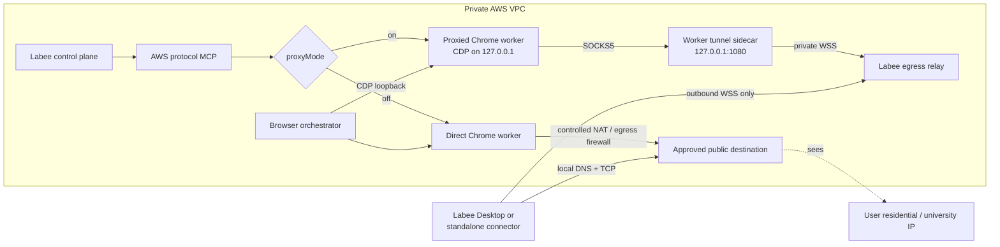

# AWS Chrome with user-local egress

Status: design proposal

## Objective

Run an isolated Chrome research worker on AWS with two explicit modes: ordinary
AWS egress when user proxying is off, or approved destination connections from
the user's current residential or university network when proxying is on.
Labee Desktop or a standalone Labee egress connector supplies user egress for
one explicitly authorized browser job. It must not expose an inbound listener
on the user's LAN, become a general-purpose proxy, give AWS access to private
network addresses, or silently switch between user and AWS egress.

This is a network-egress feature, not browser-profile forwarding. Cookies,
passwords, browser storage, and the user's personal Chrome profile never leave
the device. University egress must be enabled only when the user is authorized
under institutional acceptable-use and licensed-resource policies.

## Decision

Expose two modes to Labee, Codex, and Claude through the AWS MCP server:

- **Proxy off (`direct`)**: Chrome uses controlled AWS egress. No desktop or
  companion connector is required.
- **Proxy on (`user-proxy`)**: Chrome is fail-closed behind a device-initiated,
  multiplexed WebSocket tunnel and targets observe the user's public address.

Proxy-on works as follows:

1. Chrome and its controller run together on a private AWS worker.
2. Chrome is forced through a SOCKS5 listener bound to `127.0.0.1` on that
   worker.
3. The SOCKS listener transports streams through an authenticated WSS relay.
4. Labee Desktop maintains the other WSS leg, validates each requested
   hostname, resolves it locally, and opens the destination TCP connection.
5. The destination therefore observes the user's public residential or
   university address.

The hosted Labee server remains the control plane and token issuer. Put the
high-volume binary relay in a separate `@labee/egress-relay` process so browser
traffic cannot starve normal API, SSE, auth, or research-run handling.



The two worker types use different task definitions, subnets, and security
groups. Do not enable or disable a NAT route dynamically on one running worker.
This makes the selected mode auditable and prevents a failed user tunnel from
quietly becoming direct AWS traffic.

## Why SOCKS5

Chrome can proxy HTTP and HTTPS URL loads through SOCKS5 while sending target
hostnames to the proxy. This lets the desktop, rather than AWS, perform DNS
resolution. Launch Chrome with:

```text
--proxy-server=socks5://127.0.0.1:1080
--host-resolver-rules="MAP * ~NOTFOUND, EXCLUDE 127.0.0.1"
--disable-quic
--remote-debugging-address=127.0.0.1
--remote-debugging-port=9222
```

The resolver rule is essential: SOCKS proxying alone does not prevent every
Chrome component from issuing DNS requests. The worker subnet must also have no
general internet route, making proxy bypass fail closed.

## Components in BigSur

### 1. Contracts

Add `packages/contracts/src/browserEgress.ts`:

- `ProxyMode`: `off` or `on` at the public boundary, normalized internally to
  `direct` or `user-proxy`.
- `EgressLeaseRequest`: job id, requested source ids/domains, maximum duration,
  bandwidth cap, and network label (`residential` or `university`).
- `EgressLease`: lease id, expiry, approved host patterns, device id, worker id,
  and state.
- `EgressStatus`: connecting, ready, active, revoked, expired, or failed.
- UI request/response schemas for consent, status, and revocation.

Do not send the desktop a worker credential or the worker a device credential.

### 2. Labee control plane

Add `apps/server/src/routes/browserEgress.ts` and a distinct token scope in
`apps/server/src/services/session.ts`.

Suggested endpoints:

```text
POST   /api/browser-egress/leases
GET    /api/browser-egress/leases/:id
DELETE /api/browser-egress/leases/:id
POST   /api/browser-egress/leases/:id/device-token
POST   /internal/browser-egress/leases/:id/worker-token
```

Each lease gets two one-time role-bound tokens:

- `egress-device`: user, device public key, lease id, allowlist hash, nonce,
  expiry.
- `egress-worker`: AWS task identity, lease id, allowlist hash, nonce, expiry.

Use a 10-minute default lease and a 30-minute hard maximum. Consume each nonce
on first tunnel attachment. A token for one role must never authenticate the
other role or any existing Labee proxy/MCP route.

### 3. Binary relay

Add `apps/egress-relay/` as a small Node service using TLS WebSockets. The relay
pairs exactly one device connection and one worker connection for a lease. It
does not resolve targets or initiate target connections.

Binary protocol frames:

```text
HELLO      lease, role, token, protocol version
OPEN       stream id, hostname, port
OPEN_OK    stream id
OPEN_ERR   stream id, stable reason code
DATA       stream id, sequence, bytes
WINDOW     stream id, receive capacity
CLOSE      stream id, reason
PING/PONG  connection liveness
```

Requirements:

- 64 KiB maximum data frames and explicit per-stream flow control.
- Bounded connection and stream buffers; pause socket reads under backpressure.
- 25-second application heartbeat. An AWS ALB supports WebSockets but defaults
  to a 60-second idle timeout.
- No request/response bodies in logs. Record lease, role, byte counts, duration,
  terminal reason, and approved destination hostname only.
- Disconnect both peers and close every stream when the lease is revoked,
  expires, or either peer loses authentication.

For the single-user MVP, run exactly one relay instance. At production scale,
do not assume ALB WebSocket stickiness will pair two independent connections:
it pins each upgraded connection, not both roles for the same lease. Put a
lease-aware Envoy/HAProxy rendezvous tier in front of the relay pool and
consistent-hash the lease id to a relay shard, or assign both peers an explicit
relay shard endpoint when the lease is created. The public desktop path and
private worker path must use the same rendezvous decision.

WSS already protects the tunnel transport and destination HTTPS remains
end-to-end between Chrome and the destination. A later version can add a
device/worker Noise handshake if relay-blind payload confidentiality is needed.

### 4. Desktop egress connector

Implement the connector in Electron main, not the renderer:

```text
apps/desktop/src/browserEgress/connector.ts
apps/desktop/src/browserEgress/policy.ts
apps/desktop/src/browserEgress/deviceIdentity.ts
```

The connector always initiates its WSS connection outward over port 443. It
never binds a TCP port on the LAN. Store the device private key using Electron
`safeStorage`; keep lease tokens only in memory.

For every `OPEN` request:

1. Require port 443 in v1. Add port 80 only through a separate explicit policy.
2. Match the hostname against the immutable lease allowlist using label-boundary
   suffix matching.
3. Reject IP literals by default.
4. Resolve with the user's local resolver.
5. Reject the stream if any answer is loopback, link-local, RFC 1918, carrier
   grade NAT, multicast, documentation, or otherwise non-public.
6. Connect to an approved resolved address, not by resolving the hostname a
   second time.
7. Enforce per-stream, per-lease, time, and byte quotas.

This blocks the AWS browser from reaching the user's router, NAS, localhost,
campus intranet, cloud metadata services, or DNS-rebinding targets. Access to a
public journal host from an authorized university address still works because
the destination itself is public.

### 5. Desktop UI and consent

Add a Remote Browser Network panel with three modes:

- Off
- Ask for each research run (default)
- Allow for this device, but still show the per-run domain summary

Before a lease starts, show:

- AWS is running the browser.
- Sites will observe this device's current public IP.
- Exact requested domain patterns, maximum duration, and byte cap.
- A university-network acknowledgment covering institutional acceptable-use
  and licensed-resource rules.
- A prominent Stop sharing network button.

Never infer `university` from network names or IP ownership. The user labels the
network and affirms authorization. Changing networks, sleep/wake, logout, or
closing Labee revokes the lease.

### 6. AWS proxied browser worker

Use ECS on EC2 for the first production version rather than Fargate. Chrome
benefits from a large `/dev/shm`, while Fargate does not support the ECS
`sharedMemorySize` parameter. A practical first host is one `m7i.large` per
concurrent browser, managed by an Auto Scaling group; tune after measuring real
memory and CPU use.

Each task contains:

- Chrome/Chromium
- browser orchestrator
- SOCKS5 tunnel sidecar

Controls:

- Chrome CDP binds only to `127.0.0.1`; port 9222 is never in a security group,
  load balancer, or host port mapping.
- The task/instance has no public IP and no default NAT/IGW route.
- Worker security-group egress is limited to the internal relay target and AWS
  interface endpoints needed for ECR, CloudWatch, SSM, and secrets.
- The worker obtains its one-time lease token from the control plane through an
  IAM-authenticated internal route.
- No direct-internet fallback. If the device tunnel is absent, Chrome navigation
  fails with a stable `egress-unavailable` result.
- Use an ephemeral browser profile per job and destroy it on completion.

Expose the rendezvous/relay tier publicly through an HTTPS ALB only for the
desktop WSS leg. Give workers a private service endpoint to the same rendezvous
tier. Configure a 300-second ALB idle timeout and retain the 25-second
application heartbeat. WebSocket connections are individually pinned to the
target that accepted the upgrade, so lease-aware rendezvous remains necessary
when more than one relay shard is active.

### 7. MCP clients and configurable proxy mode

The protocol MCP server runs in AWS and remains usable as a normal remote MCP
from Labee, Codex, Claude Code, or another Streamable HTTP MCP client. Proxying
is a job/tool option, not an assumption tied to the Labee UI.

Keep browser selection and network selection independent:

```text
browser:    off | auto | cdp
proxyMode:  off | on
```

- `browser=off, proxyMode=off`: no browser worker is launched.
- `browser=off, proxyMode=on`: reject the input as `proxy-requires-browser`
  rather than silently changing the requested mode.
- `browser=auto|cdp, proxyMode=off`: use the direct AWS worker pool.
- `browser=auto|cdp, proxyMode=on`: require an active, same-user egress
  connector and use the isolated proxied worker pool.

Add `proxyMode` and optional `egressDeviceId` to browser-capable MCP tools,
including `deep_search_start`, browser-backed `search`, and browser-backed
`fetch`. Persist the requested mode in the durable job specification so resume
cannot change egress. Every result must report both `requestedProxyMode` and
`effectiveProxyMode`.

Add two MCP tools:

```text
browser_egress_status   # read-only capability and connector status
browser_egress_revoke   # revoke this user's active lease/job
```

`browser_egress_status` may report availability, device label, lease expiry,
and approved hostname count, but not the user's precise public IP or other
users' devices.

Configuration priority is deterministic:

1. Explicit MCP tool argument.
2. Per-user MCP preference stored by the control plane.
3. `BROWSER_EGRESS_DEFAULT=off` on the AWS MCP service.

The default is always off. Operators can independently gate each capability:

```text
BROWSER_EGRESS_DIRECT_ENABLED=true
BROWSER_EGRESS_USER_PROXY_ENABLED=false
BROWSER_EGRESS_DEFAULT=off
```

There is deliberately no `auto` value for `proxyMode`. If `on` is requested and
the connector, consent, lease, or isolated worker is unavailable, return a
stable `user-proxy-unavailable` terminal status. Never retry through AWS direct
egress. If `off` is requested while direct workers are disabled, return
`direct-egress-disabled`.

#### Labee client

Labee Desktop creates the connector lease from the consent UI and supplies the
lease/device identity automatically. The model may request proxy-on, but the
desktop's prior user consent and source-derived hostname policy remain the
authority.

#### Codex and Claude clients

Proxy-off requires only the ordinary authenticated AWS MCP configuration and
works without Labee Desktop.

Proxy-on requires a small standalone companion distributed from this monorepo,
for example `@labee/egress-connector`:

```text
labee-egress connect --device "Research Mac" --duration 30m
```

The connector signs into the same Labee account in the system browser, shows
the same destination/university consent, stores a device key in the OS keychain,
and establishes the outbound WSS tunnel. Codex or Claude then calls the MCP
tool with `proxyMode: "on"` and, when more than one device is connected,
`egressDeviceId`.

Do not place a residential/university proxy credential or tunnel token in
Codex/Claude MCP configuration. Their MCP config contains only the existing
user-scoped MCP bearer credential. A shared service/admin token is sufficient
for proxy-off but must not be allowed to select a user's connector; proxy-on
requires a user-scoped MCP identity matching the connector lease.

#### Scope of proxying

In v1, `proxyMode` controls only Chrome website/XHR navigation and browser-based
full-text recovery. Scholarly APIs and deterministic server-side OA fetches
continue through their normal AWS HTTP clients. This minimizes use of the
user's network and makes provenance clear. A future `proxyScope=all-http` would
need a separate design and must not be inferred from `proxyMode=on`.

### 8. Direct AWS worker pool

Proxy-off workers run in a separate private subnet with controlled outbound
access through a NAT gateway and, preferably, AWS Network Firewall/domain
policy. They retain the same CDP-loopback, ephemeral-profile, destination
allowlist, quota, and terminal-blocker rules as proxied workers.

Proxy-on workers run in the isolated subnet described above, with no NAT or
internet gateway route. Both pools use the same browser image and orchestrator
version so egress mode is the only intended behavioral difference.

The MCP scheduler selects the pool before starting a worker:

```text
proxyMode=off  -> browser-direct task definition + direct subnet/SG
proxyMode=on   -> browser-user-proxy task definition + isolated subnet/SG
```

Worker metadata, attempt logs, and findings include `egress=aws-direct` or
`egress=user-proxy`; they never store the user's raw proxy token or IP.

## Request lifecycle

1. Labee, Codex, or Claude starts a remote-browser MCP job with an explicit or
   defaulted `proxyMode`.
2. The MCP server authenticates the caller, freezes the mode in the durable job,
   computes the source-derived destination allowlist, and records the requested
   mode.
3. For proxy-off, the scheduler starts a direct worker. Chrome uses controlled
   AWS egress and the job records `effectiveProxyMode: off`.
4. For proxy-on, Labee Desktop or the standalone connector presents/has already
   captured user consent. The control plane verifies the same-user device and
   creates a short-lived lease.
5. The proxied worker and connector independently obtain role-specific,
   one-time tokens and attach to the relay.
6. The worker reports SOCKS ready; only then does the orchestrator launch Chrome.
7. Chrome requests a destination through SOCKS5. The sidecar emits `OPEN` with
   the hostname and port.
8. The connector applies policy, resolves locally, opens the public connection,
   and returns `OPEN_OK`.
9. Browser bytes flow through the paired tunnel. The destination sees the
   user's public IP and the job records `effectiveProxyMode: on`.
10. Completion, cancellation, quota exhaustion, timeout, network change, or
    connector disconnect revokes the lease and tears down Chrome and all
    streams. Proxy-on never resumes as proxy-off.

## Threat model and required controls

| Risk | Required control |
| --- | --- |
| Open proxy abuse | Outbound-only desktop connection, paired lease, no LAN listener, destination allowlist |
| AWS worker scans local/campus LAN | Local DNS resolution plus comprehensive non-public IP rejection |
| Browser bypasses proxy | Private subnet without NAT/IGW, SOCKS-only Chrome flags, disable QUIC, resolver rules |
| One user consumes another user's device | Role-separated, user/device/worker-bound one-time tokens |
| Token theft or replay | Short TTL, nonce consumption, TLS, in-memory storage, immediate revocation |
| Relay reads browsing content | HTTPS-only targets in v1; optional application-layer E2E tunnel encryption later |
| Sensitive logging | Metadata-only audit logs; never URLs beyond hostname, bodies, cookies, or content |
| University-policy violation | Explicit network label and acknowledgment, per-run domains, single-user lease, quotas |
| Device goes offline | Fail closed; never change to AWS egress automatically |
| Caller confuses on/off behavior | Persist requested/effective mode, separate worker pools, no `auto`, stable failure statuses |
| Shared MCP credential selects a user's device | Require same-user scoped MCP identity for proxy-on |

## Validation plan

### Unit tests

- Token scope, expiry, role, nonce reuse, and lease binding.
- Hostname boundary matching and Unicode/punycode normalization.
- IPv4/IPv6 private, loopback, link-local, CGNAT, multicast, and mixed-answer
  rejection.
- SOCKS5 parsing, frame parsing, stream state machine, flow control, and quotas.
- Revocation closes every socket and erases in-memory credentials.

### Integration tests

- Pair a fake worker and desktop through the relay; transfer data with forced
  fragmentation and backpressure.
- Confirm a public HTTPS echo endpoint observes the desktop's public IP, while
  the worker's AWS IP differs.
- Confirm private and link-local targets are rejected before dialing.
- Remove the device tunnel and prove Chrome cannot reach the internet directly.
- Run proxy-off without any connector and prove Chrome uses only the direct
  worker/NAT path.
- Request proxy-on without a connector and assert `user-proxy-unavailable`,
  with no direct-worker launch.
- Resume jobs in both modes and prove the persisted mode cannot change.
- Exercise proxy-off from Codex and Claude MCP clients without Labee running.
- Exercise proxy-on from Codex and Claude while the standalone connector is
  paired to the same user, and reject a connector owned by another user.
- Verify DNS requests do not leave the AWS worker subnet.
- Exercise laptop sleep/wake, Wi-Fi changes, relay restart, lease expiry, and
  user cancellation.

### Browser acceptance loop

For each of five protocol keywords:

1. Run every configured scholarly and web search backend.
2. Run the browser-backed Semantic Scholar search independently of API success.
3. Fetch every merged result.
4. Record route, source hostname, bytes, elapsed time, observed egress class,
   and terminal status.
5. Treat authentication, CAPTCHA, robots, WAF, and paywall responses as terminal
   blockers rather than bypassing them.

Success requires all backend/source pairs to be attempted and all result ids to
receive a fetch attempt. Proxy-on runs must have no AWS direct-egress packets
and must tear down immediately when the user revokes consent. Proxy-off runs
must have no device-tunnel traffic and must report AWS-direct provenance.

## Delivery phases

### Phase 0 — policy and proof

- Confirm university acceptable-use requirements.
- Prototype one leased SOCKS stream through WSS.
- Measure latency, throughput, and the target-observed IP.
- Prove private-address and AWS-egress leak tests before browsing real sites.

### Phase 1 — single-user MVP

- MCP `proxyMode`, direct and proxied EC2 worker task definitions, Electron
  connector, standalone connector CLI, control-plane lease routes, one relay
  instance, fixed source-derived allowlist, and explicit per-run consent.
- Verify proxy-off from Codex/Claude without Labee Desktop and proxy-on from the
  same clients with the companion connector.
- No persistence, sharing, generic destinations, plain HTTP, or automatic
  fallback.

### Phase 2 — hardening

- Device identity, one-time token consumption, quotas, reconnect semantics,
  backpressure, audit UI, ASG lifecycle, private AWS endpoints, and alarms.

### Phase 3 — production

- Multi-AZ relay, draining-aware WebSocket deployments, per-user concurrency,
  abuse monitoring, cost controls, institutional policy documentation, and an
  external security review.

## Rejected alternatives

- **Expose a proxy port on the laptop:** rejected because NAT, firewalls, and
  open-proxy risk make inbound connectivity unsafe and unreliable.
- **Give AWS the user's VPN credentials:** rejected because it expands the
  credential and network blast radius and may route non-browser traffic.
- **Forward the user's Chrome profile:** rejected because cookies and personal
  sessions are not required for IP egress and create much higher risk.
- **Rely only on Chrome proxy flags:** rejected because DNS and non-URL browser
  traffic can bypass them; AWS network isolation is also required.
- **Fargate first:** rejected for the initial browser runtime because its ECS
  task parameters do not support configurable shared memory.
- **SSH reverse dynamic forwarding as production:** useful for a tightly
  controlled proof of concept, but poor for user consent, per-domain policy,
  browser-job pairing, revocation, and desktop packaging. WSS on port 443 fits
  the Labee control plane and common residential/university firewalls better.

## Open decisions

1. Whether the relay is deployed as a new ECS service or initially co-located
   with the hosted Labee server behind a separate process and resource limits.
2. Whether v1 supports only source-catalog domains or lets users add domains in
   the consent dialog.
3. Whether metadata logs retain full hostnames or keyed hashes after the live
   audit window.
4. Whether relay-blind Noise encryption is required for v1 or deferred while
   HTTPS-only destination policy is enforced.
5. Whether AWS workers are one-task-per-job or a small pre-warmed pool.
6. Whether the standalone connector ships as its own npm executable or as a
   headless mode of Labee Desktop.

## References

- [Chromium: configuring a SOCKS proxy and preventing DNS leaks](https://new.chromium.org/developers/design-documents/network-stack/socks-proxy/)
- [AWS: Application Load Balancer WebSocket support](https://docs.aws.amazon.com/elasticloadbalancing/latest/application/load-balancer-listeners.html#websockets)
- [AWS: Application Load Balancer idle timeout](https://docs.aws.amazon.com/elasticloadbalancing/latest/application/edit-load-balancer-attributes.html#connection-idle-timeout)
- [AWS: ECS task-definition differences for Fargate](https://docs.aws.amazon.com/AmazonECS/latest/developerguide/fargate-tasks-services.html)
- [AWS: private ECR access through VPC endpoints](https://docs.aws.amazon.com/AmazonECR/latest/userguide/vpc-endpoints.html)
